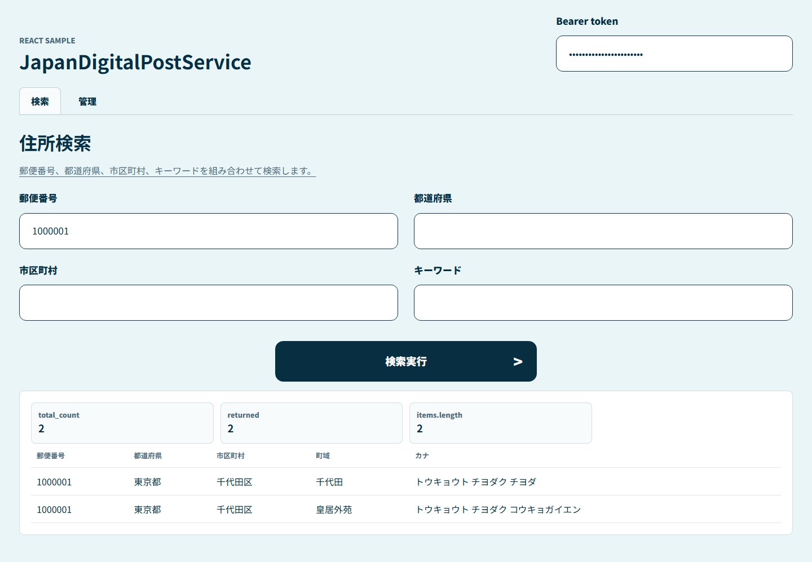
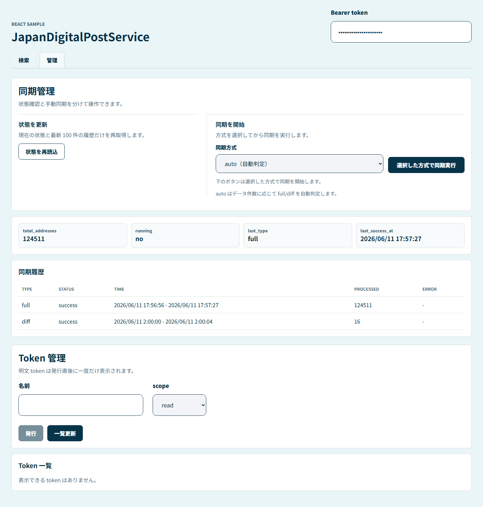
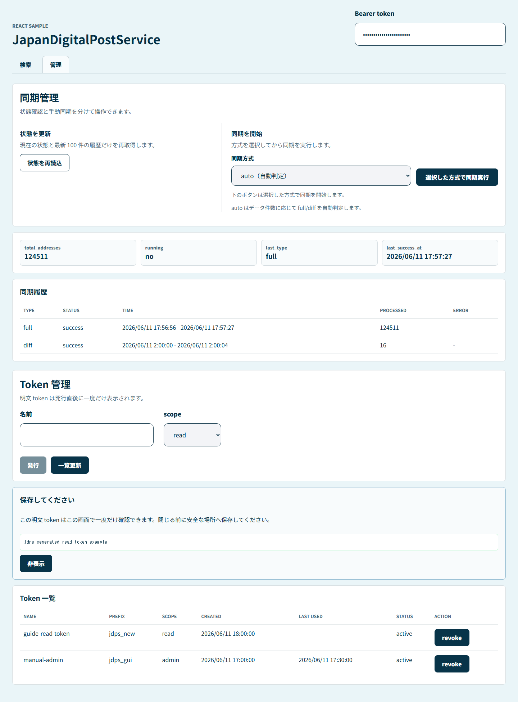

# UI User Guide

Language: [Chinese](README.md) | [Japanese](README.ja.md) | [English](README.en.md)

This guide is for manual testing and routine checks. It explains the main operation paths in the React sample screen. The screenshots use fixed sample data to show where interactions happen; in a real run, addresses, timestamps, and token lists vary with the database contents.

## 1. Open the Screen

The recommended startup path is the full manual-test container:

```bash
docker compose -f deployments/manual-test.compose.yml up -d --build
```

Open `http://localhost:8080` in a browser. The default manual-test admin token is configured in `deployments/manual-test.env` as:

```text
jdps_manual_admin_token
```

Enter only the token value in the `Bearer token` field in the top-right corner. Do not enter the `Bearer ` prefix. The frontend stores the token only in the browser's `sessionStorage`, so it must be entered again after that browser session is closed.

The current `deployments/manual-test.env` enables application-layer response encryption for AES-GCM manual testing:

```text
PAYLOAD_ENCRYPTION=aes-gcm
PAYLOAD_ENC_KEY=MDEyMzQ1Njc4OWFiY2RlZjAxMjM0NTY3ODlhYmNkZWY=
PAYLOAD_ENC_KEY_ID=manual-test
```

Enter the same base64(32B) `PAYLOAD_ENC_KEY` in the `API 暗号化 key` field in the top-right corner. When the response header is `X-Payload-Encryption: AES-256-GCM`, the frontend automatically decrypts the JSON envelope. This key is also stored only in the current browser `sessionStorage`. If the backend is changed back to `PAYLOAD_ENCRYPTION=none`, this field can be left empty.

For frontend development, Vite can also be started separately:

```bash
npm install --prefix web
npm run dev --prefix web
```

The Vite screen is available at `http://localhost:5173` by default and proxies `/v1` to the local `:8080` backend.

## 2. Tokens and Permissions

| scope | Available screens/actions | Notes |
|---|---|---|
| `read` | Address search, sync status read, sync history read | For read-only query users. |
| `admin` | All `read` capabilities, manual sync, token creation, token list, token revocation | For administrative operations. |

Common rules:

- The search page accepts either a `read` or `admin` token.
- The admin page can read sync status/history with either a `read` or `admin` token.
- Sync execution, token creation, token listing, and token revocation on the admin page require an `admin` token.
- The plaintext value of a newly created token is shown only once after creation. After it is closed or hidden, it cannot be recovered; issue a new token with an existing admin token.

## 3. Address Search

After entering the 「検索」 tab, you can search by postal code, prefecture, city/ward/town/village, and keyword in combination. Enter at least one condition, then click 「検索実行」.



Meaning of the result area:

| Item | Meaning |
|---|---|
| `total_count` | Total number of matching records on the backend. |
| `returned` | Number of records returned in this response. This corresponds to API `returned_count`. |
| `items.length` | Length of the address array actually received by the frontend. Usually the same as `returned`. |
| Results table | Shows postal code, prefecture, city/ward/town/village, town area, and kana. |

Status messages:

- `too_many_results`: The conditions are too broad and exceed the server threshold. Narrow the search conditions.
- `timeout`: The query exceeded the time limit. Narrow the search conditions or check backend load.
- `0 件`: The request succeeded, but no matching address was found.
- `401`: No token was entered, or the token is invalid/expired.
- `403`: The token is valid, but its permission is insufficient.

## 4. Sync Management

After entering the 「管理」 tab, the upper half is sync management. The screen separates 「状態確認」 and 「手動同期」 into two areas to avoid confusion about the scope of the dropdown.



Left-side 「状態を更新」:

- 「状態を再読込」 only reloads the current sync status and the latest 100 sync history records.
- This button is not affected by the 「同期方式」 dropdown on the right.

Right-side 「同期を開始」:

- Select 「同期方式」 first, then click 「選択した方式で同期実行」.
- The dropdown affects only this sync execution button.

Sync modes:

| Mode | Meaning |
|---|---|
| `auto` | The backend decides automatically: full if the database is empty, otherwise diff. |
| `full` | Force a full sync. |
| `diff` | Force a differential sync. |

Status cards:

| Item | Meaning |
|---|---|
| `total_addresses` | Current number of records in the address master table. |
| `running` | Whether a sync is currently running. |
| `last_type` | Most recent successful sync type. |
| `last_success_at` | Completion time of the most recent successful sync. |

Sync history:

- Shows the latest 100 persisted sync records.
- After a browser refresh, if a token is present, records are reloaded from the backend and do not depend on frontend memory.
- `processed` shows the number of rows processed in the run; `skipped` shows the number of rows skipped by the town-name filter regex; `error` shows the failure summary and is usually `-` on success.
- Sync history displays 6 rows per page. Use 「前へ」/「次へ」 below the table to change pages.
- When `skipped` is greater than 0, a 「照会」 button appears after the number. Clicking it opens the 「除外行明細」 modal to inspect filter details for that sync run.
- Filter details are loaded 100 rows per page. Use 「前へ」/「次へ」 to change pages; the current page number is shown at the bottom of the modal.
- The detail table includes source, line, zipcode, prefecture / city / town, town_kana, pattern, and raw. `raw_record_json` is truncated by default. Click 「raw を表示」 to expand the full JSON, then 「raw を隠す」 to collapse it.

### 4.1 Fetch/Import Settings (Retry Count / Full URL / Town-Name Filter)

Fetch and import behavior can be configured online and is **kept after restart**:

- **Network retry count** (`download_max_retry`, default `3`): Additional retry count when network issues occur while fetching data from Japan Post. Valid range: 0 to 10.
- **Full fetch URL** (`scrape_full_url`, default = official full URL in configuration): Can be changed to another https URL under the official Japan Post domain (`post.japanpost.jp`). Use the restore-default action to return to the default URL.
- **Town-name filter regex** (`town_skip_regex`, default empty): Matches imported rows by town name. Matching rows are not written to the address master table and are recorded in filter details. This field is validated by backend Go regex rules; the frontend does not block saving with JavaScript regex validation.
- Priority: Admin screen settings (persisted in DB) > environment variables > code defaults. Changes take effect on the **next sync** (scheduled / manually triggered / `cmd/batch`) with no restart required.
- URL / regex validation, error messages, and save-success messages are all in Japanese. Non-https URLs, URLs outside the official domain, and invalid Go regexes are rejected.

Screen operations:

1. Enter an integer from 0 to 10 in 「リトライ回数」. If it is out of range or not an integer, the screen shows 「リトライ回数は 0 以上 10 以下の整数で指定してください。」 and does not save.
2. Enter an https URL under the official Japan Post domain (`post.japanpost.jp` / `www.post.japanpost.jp`) in 「全量取得 URL」. Non-https URLs and URLs outside the official domain are rejected with Japanese error messages.
3. Enter a Go regex for the town-name filter in 「町域名フィルター」. Leave it empty to disable filtering. If backend validation fails, the screen shows 「町域名フィルターの正規表現が正しくありません。」.
4. Click 「保存」. On success, the screen shows 「設定を保存しました。」, and the value saved to the DB is used for later syncs or upload imports.
5. Click 「既定値に戻す」 to delete the override values for `download_max_retry`, `scrape_full_url`, and `town_skip_regex`, restoring their defaults.

Backend API: `GET /v1/admin/settings` / `PUT /v1/admin/settings` (both require an `admin` token; see [`docs/api/v1.md`](../api/v1.md) for the contract).

### 4.2 File Upload

In 「ファイルアップロード」, you can import a Japan Post `utf_ken_all` zip or UTF-8 csv as a full sync.

1. Drag a `.zip` or `.csv` file onto 「zip/csv をドラッグ、またはクリックして選択」. You can also click the area and choose a file from the file picker.
2. Unsupported extensions show 「zip または csv ファイルを選択してください。」 and cannot be uploaded.
3. After choosing a file, click 「アップロード実行」. During execution, the button text changes to 「アップロード中」.
4. On success, the full-sync result is reflected on the screen, and the status and 「同期履歴」 are reloaded.
5. On failure, the backend's Japanese message is shown. For example, a non-UTF-8 `utf_ken_all` CSV such as the Shift-JIS version shows 「UTF-8 の utf_ken_all CSV のみ対応しています。Shift-JIS 版は利用できません。」.

## 5. Token Management

「Token 管理」 is in the lower half of the admin page and requires an `admin` token.



Create a token:

1. Enter the intended use in 「名前」, for example `frontend-read`.
2. Select `read` or `admin` in `scope`.
3. Click 「発行」.
4. Copy the plaintext token from the 「保存してください」 area and store it in a safe place.

Token list:

- `prefix` is a masked prefix for identifying the token. It is not the full token.
- `scope` indicates the permission.
- `last_used` indicates the most recent usage time, or `-` if unused.
- `revoke` revokes that token. A revoked token cannot be restored.

## 6. Troubleshooting

| Symptom | Action |
|---|---|
| The screen shows `401` | Confirm that the top-right field contains only the token value and does not include the `Bearer ` prefix. |
| The screen shows `403` | The current token has insufficient permissions. Sync execution and token management require an admin token. |
| Sync trigger returns `sync_running` | A sync is already running. Wait until it finishes, then click 「状態を再読込」. |
| Saving 「町域名フィルター」 fails | Confirm that the input is a Go regex. For example, Go-supported `(?i)町域` can be saved; invalid syntax shows the Japanese error returned by the backend. |
| There is no 「照会」 in sync history | That run's `rows_skipped` is 0. The filter-detail entry appears only for runs that actually skipped imported rows. |
| Search results are too many | Add postal code, prefecture, city/ward/town/village, or keyword conditions. |
| Plaintext for a new token was lost | The server stores only the hash and cannot recover it. Issue a new token with an existing admin token. |
| Bearer token disappears after refresh | The token is stored in `sessionStorage`; a new browser session requires re-entry. |
| The screen asks for an AES-GCM key | The backend returned an encrypted response. Confirm that `API 暗号化 key` contains the base64(32B) `PAYLOAD_ENC_KEY` and that it matches the backend's current key. |

Production notes:

- Do not use the default manual-test token.
- The production bootstrap admin token should be injected through `ADMIN_BOOTSTRAP_TOKEN` from a secure environment variable or key management system.
- Do not write real tokens or `PAYLOAD_ENC_KEY` into image layers, README files, screenshots, or commit history.
